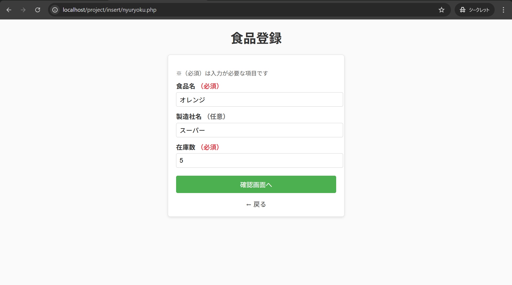
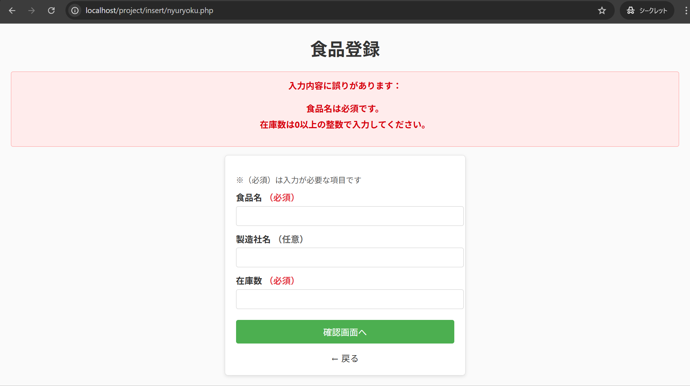
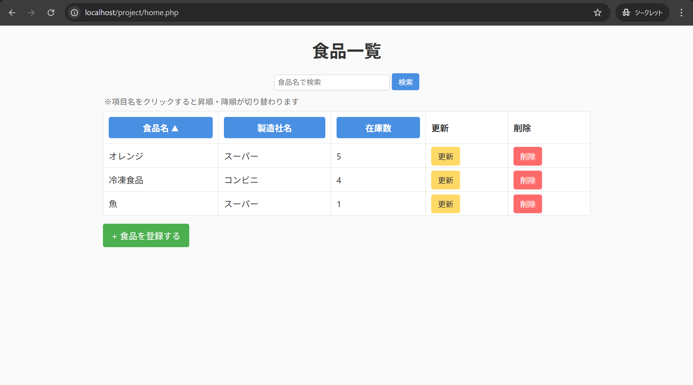
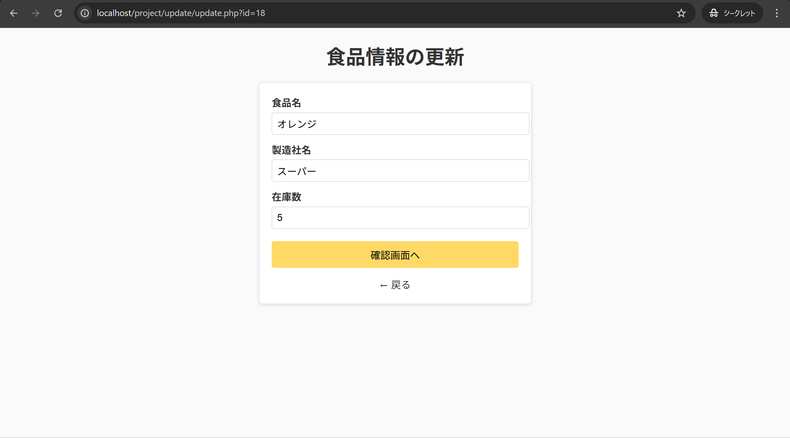

# food-inventory-system
PHP/MySQL を使用した食品在庫管理システム

# 食品在庫管理システム（Food Inventory System）

PHP / MySQL を使用して開発した、食品の在庫管理システムです。  
食品の登録・更新・削除・検索・ソートなど、基本的な CRUD 操作を備えています。  
UI/UX を意識し、エラー表示や入力補助など、ユーザーが使いやすい画面設計を行いました。

## 主な機能

食品登録機能
 - 食品名（必須）
 - 製造社名（任意）
 - 在庫数（必須・0以上の整数）
 - 入力チェック（バリデーション）
 - エラー時のメッセージ表示（箇条書き・中央寄せ）

食品一覧表示
- 登録された食品を一覧で表示
- 在庫数の昇順・降順ソート
- 在庫 0 の食品を強調表示（UI/UX 改善）

食品情報の更新
- 既存データの編集
- 更新完了画面の表示

食品の削除
- 削除確認画面あり
- 誤操作防止の UI 設計
  
## 使用技術
- 言語：PHP / HTML / CSS
- データベース：MySQL 
- その他 ：PDO / セッション管理

##  DB 接続ファイルについて

セキュリティのため、実際の接続情報を含む **mydb.php** は公開していません。  
代わりに **mydb_sample.php** を掲載しています。

実行する際は、mydb_sample.php をコピーして **mydb.php** を作成し、  
以下の項目を環境に合わせて書き換えてください。

- host
- dbname
- username
- password

##  セットアップ手順

1. リポジトリをクローンまたは ZIP をダウンロード
2. MySQL に `kanri.sql` をインポート
3. `mydb_sample.php` を `mydb.php` にコピー
4. `mydb.php` の接続情報を編集
5. ローカルサーバー（XAMPP など）で `home.php` を開く

## 画面サンプル

### ● 食品登録画面

### ● エラー表示（バリデーション）

### ● 一覧画面（在庫ソート）

### ● 更新画面

